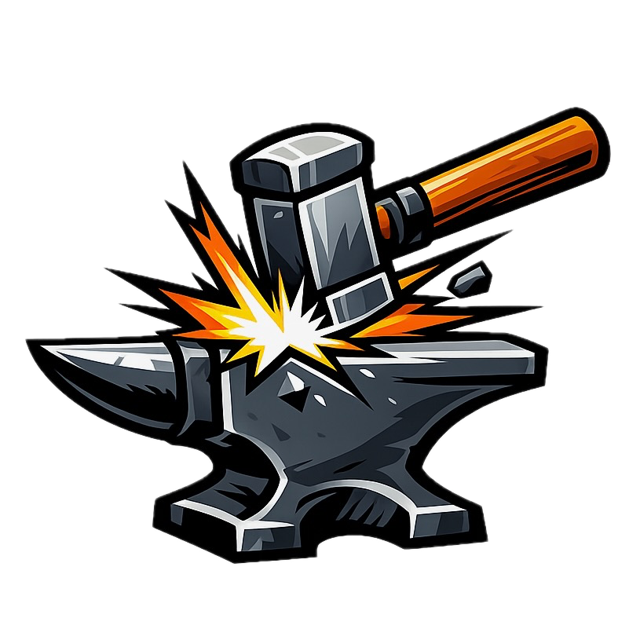

<p align="center">
  
</p>

<h1 align="center">Anvil</h1>

<p align="center">
  Spec-driven project management for solo developers using AI agents.
</p>

<p align="center">
  <a href="https://github.com/ppazosp/anvil/blob/main/LICENSE"></a>
  <a href="https://github.com/ppazosp/anvil/releases"></a>
  <a href="https://skills.sh/ppazosp/anvil"></a>
  <a href="https://agentskills.io"></a>
</p>

<p align="center">
  Forge specs into issues. Strike them into code.<br>
  All state in markdown. Zero external services.
</p>

---

## Install

### Any Agent (recommended)

```bash
npx skills add ppazosp/anvil

# update later
npx skills update
```

This installs Anvil to `~/.agents/skills/anvil/` where it's automatically discovered by Claude Code, Codex, Copilot, Cursor, Gemini CLI, OpenCode, and [18+ other agents](https://agentskills.io).

### Claude Code (plugin mode)

```bash
claude plugin add /path/to/anvil
```

### Manual

Clone into your project and point your agent's instruction file (`AGENTS.md`, `.github/copilot-instructions.md`, etc.) to the `AGENTS.md` file in this repo.

## Quick Start

```bash
# 1. Cast: create a standalone issue
/cast myapp "Fix login redirect" --kind mend

# 2. Forge: interrogate → spec → phases → issues
/forge myapp

# 3. Inspect: see what's ready to build
/inspect myapp

# 4. Strike: implement a feature end-to-end
/strike P1-001

# 5. Mend: fix a bug with TDD
/mend 003

# 6. Quench: manually close an issue
/quench P1-002
```

## Commands

| Command | What it does |
|---------|-------------|
| `/cast <project> <title>` | Create a standalone issue .md file |
| `/forge <project>` | Spec interrogation → phase breakdown → issue .md files with parallelism diagrams |
| `/inspect <project>` | Compact status dashboard with progress bars and ready-to-launch commands |
| `/strike <issue-id>` | Full autonomous implementation: explore → plan → TDD → simplify → review → merge |
| `/mend <issue-id>` | TDD bug fix: reproduce with failing test → fix → verify → close |
| `/quench <issue-id>` | Manually complete an issue after doing the work yourself |

## Agents

Anvil includes 4 subagent prompts in `agents/`. These are dispatched during `/strike` and `/mend` workflows.

| Agent | Role | File |
|-------|------|------|
| Explorer | Traces code paths, maps architecture, documents patterns | `agents/explorer.md` |
| Architect | Designs feature architecture, produces implementation blueprints | `agents/architect.md` |
| Simplifier | Refines code for clarity and consistency, preserves functionality | `agents/simplifier.md` |
| Reviewer | Reviews for bugs, silent failures, security issues, and test coverage gaps | `agents/reviewer.md` |

On platforms that support subagents (Claude Code, Codex), these are dispatched automatically. On platforms without subagent support, the main agent reads the prompt file and follows its instructions inline.

## How It Works

### Issue files

Issues are markdown files with YAML frontmatter in `docs/specs/<project>/issues/`:

```yaml
---
id: P1-001
title: Create user schema
status: todo
kind: strike
phase: 1
heat: data-model
priority: 1
blocked_by: []
---
```

See [docs/issue-schema.md](docs/issue-schema.md) for the full schema.

### Workflow

```
/cast
  └── Create standalone issue .md file (bug or feature)

/forge
  ├── General spec (interrogation)
  ├── Phase breakdown (dependencies, parallelism)
  ├── Phase deep-dive (requirements, ACs)
  └── Issue .md files (YAML frontmatter + body)

/inspect
  └── Parses all issue .md files → compact dashboard

/strike or /mend
  ├── Read issue .md + check blockers
  ├── Explore codebase (explorer subagent)
  ├── Design architecture (architect subagent)
  ├── Setup worktree
  ├── TDD implementation
  ├── Simplify (simplifier subagent)
  ├── Review (reviewer subagent)
  ├── Verify (evidence-based)
  └── Merge + update issue .md

/quench
  └── Append completion summary + mark done
```

### Parallelism

Forge organizes issues into heats (parallel workstreams). Issues in different heats touch different code and can run in parallel via separate worktrees:

```
Phase 1: Foundation
├── data-model heat (sequential)
│   ├── P1-001: Create schema ──▶ P1-002: Add indexes
├── auth heat (independent)
│   └── P1-003: Auth middleware
└── config heat (independent)
    └── P1-004: Environment setup

Max parallelism: 3 agents
```

## Attribution

Anvil includes code adapted from:

- [feature-dev](https://github.com/anthropics/claude-code) — Copyright Anthropic, Apache 2.0
- [pr-review-toolkit](https://github.com/anthropics/claude-code) — Copyright Anthropic, Apache 2.0
- [code-simplifier](https://github.com/anthropics/claude-code) — Copyright Anthropic, Apache 2.0
- [superpowers](https://github.com/obra/superpowers) — Copyright Jesse Vincent 2025, MIT

## License

MIT
